# Credit_Risk_Analysis

## Overview
Use machine learning to analyze credit card risk. Using 6 different methods to train and evaluate credit risk with unbalanced classes. Oversample the data using the RandomOverSampler and SMOTE algorithms, and undersample the data using the ClusterCentroids algorithm. Then, use a combinatorial approach of over- and undersampling using the SMOTEENN algorithm. Next, compare two new machine learning models that reduce bias, BalancedRandomForestClassifier and EasyEnsembleClassifier, to predict credit risk. 

## Results
1. Random Over Sampler
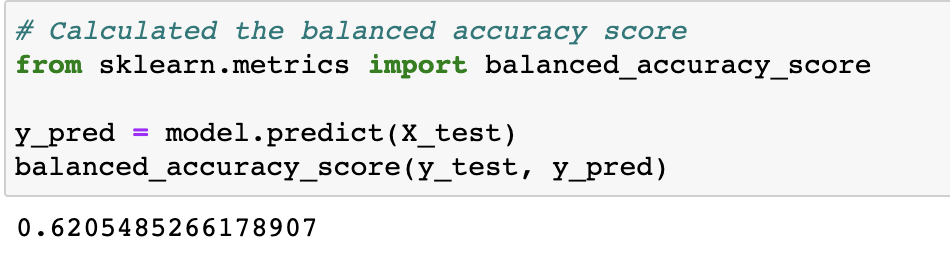
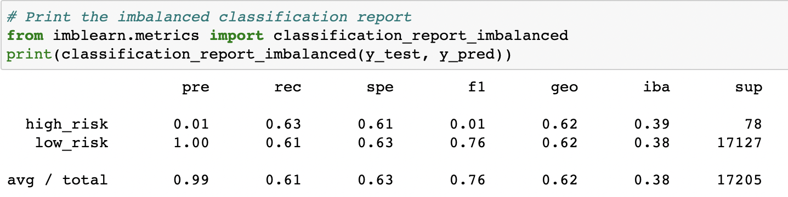

* Balanced Accuracy Score: 0.621
* Precision Score: high = 0.01 low = 1.0
* Recall Scores: high = 0.63 low = 0.61
---
2. SMOTE
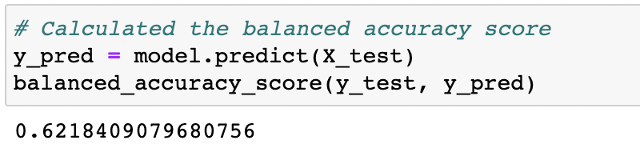
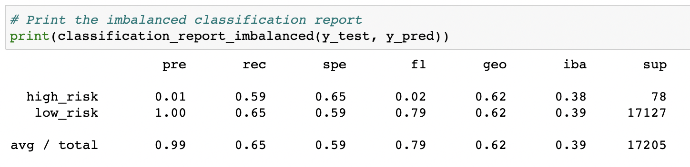

* Balanced Accuracy Score: 0.622
* Precision Score: high = 0.01 low = 1.0
* Recall Scores: high = 0.59 low = 0.65
---
3. ClusterCentroids
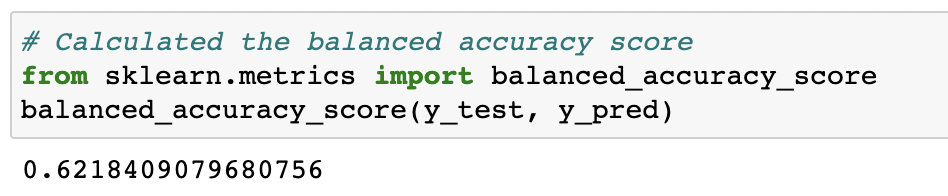
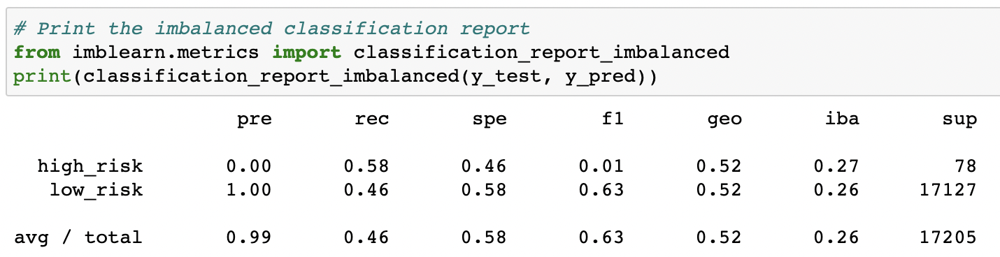

* Balanced Accuracy Score: 0.622
* Precision Score: high = 0.00 low = 1.0
* Recall Scores: high = 0.58 low = 0.46
---
4. SMOTEENN
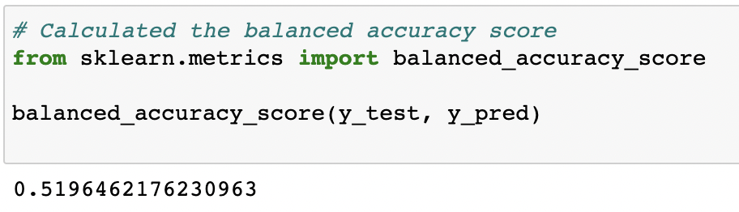
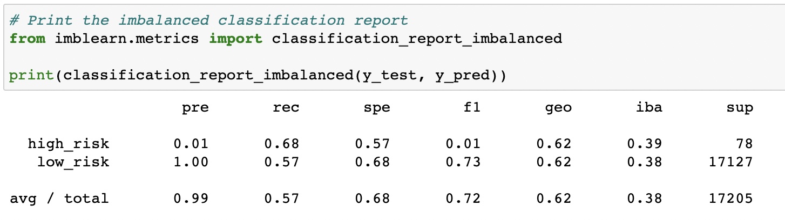

* Balanced Accuracy Score: 0.520
* Precision Score: high = 0.01 low = 1.0
* Recall Scores: high = 0.68 low = 0.57
---
5. BalancedRandomForest Classifier
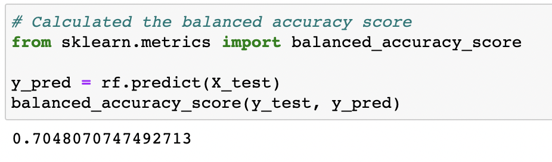
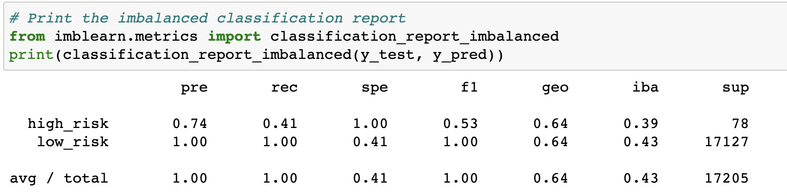

* Balanced Accuracy Score: 0.705
* Precision Score: high = 0.74 low = 1.0
* Recall Scores: high = 0.41 low = 1
---
6. EasyEnsembleClassifier
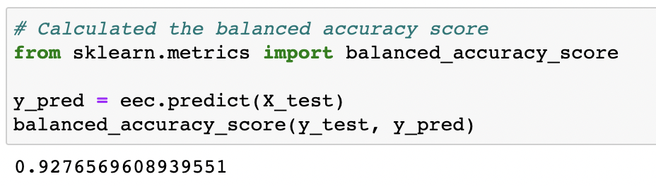
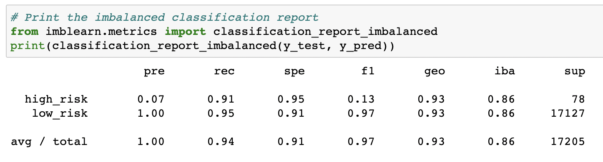

* Balanced Accuracy Score: 0.928
* Precision Score: high = 0.07 low = 1.0
* Recall Scores: high = 0.91 low = 0.95

## Summary 
In this challenge we used 6 different machine learning tools to look at credit risk - RandomOverSampler, SMOTE, ClusterCentriods, SMOTEEN, BalancedRandomForestClassifier, and EasyEnsembleClassifier. Accuracy was not high in the first 4 models, meaning that credit risk is high. 

The last model, EasyEnsembleClassifier, had the best outcome. I would recommend the bank use this model for further analysis from this dataset. This model showed the most accuracy and has a low risk precision of 100%. 
